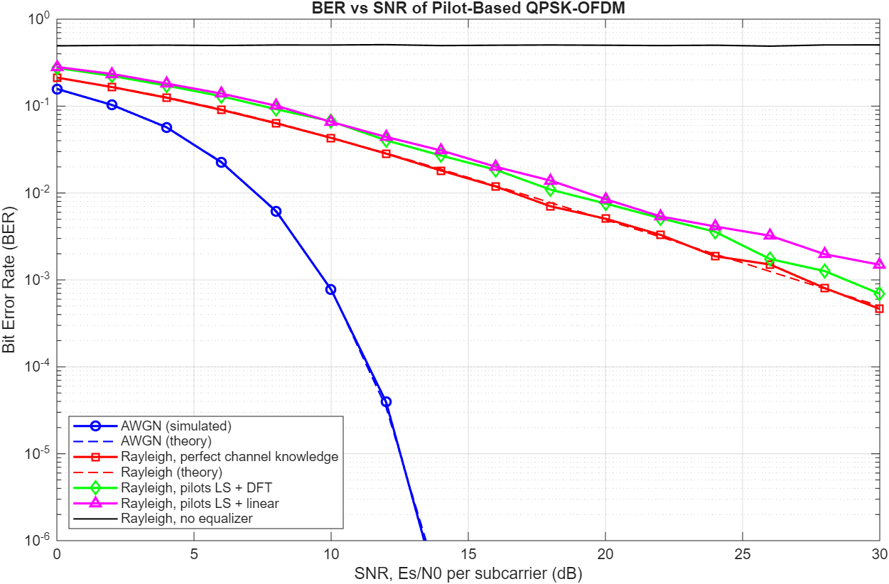
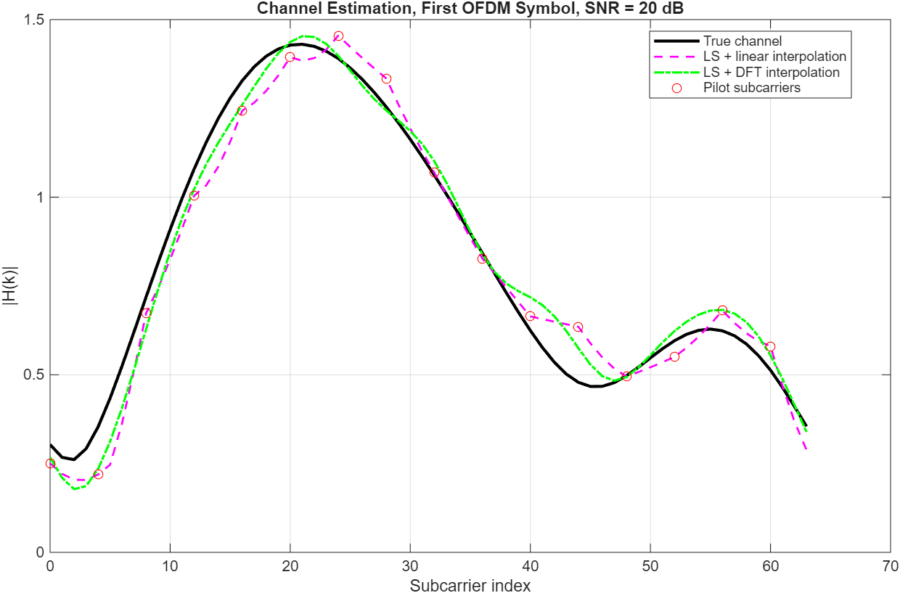
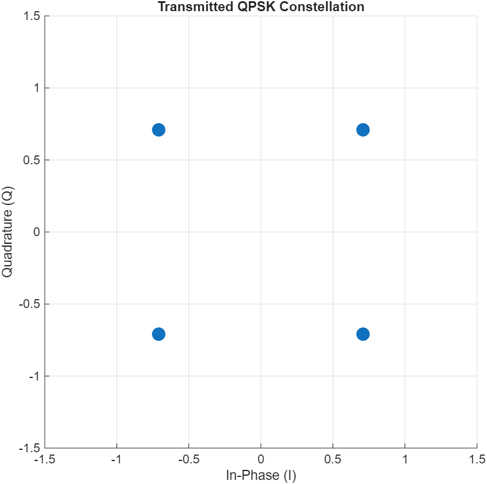
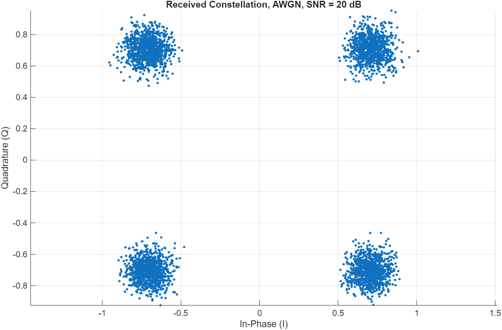
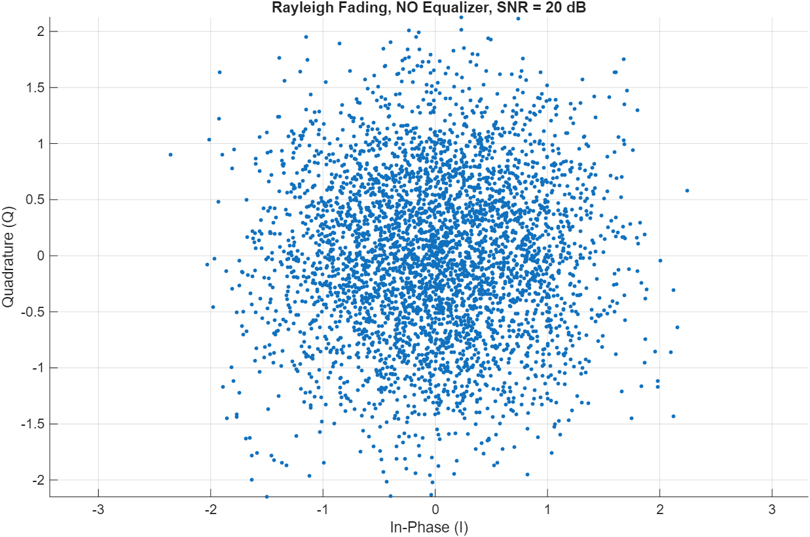
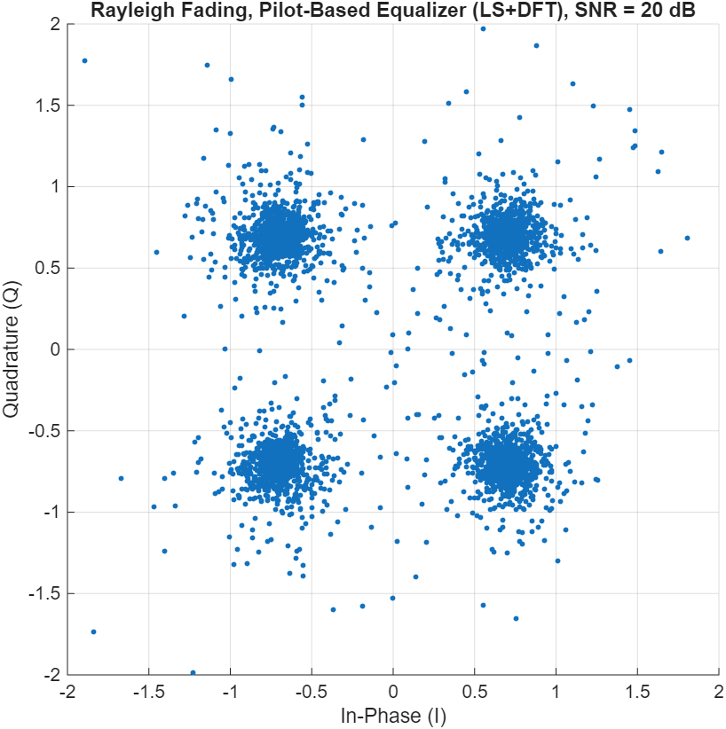

# OFDM Wireless Communication System with Pilot-Based Channel Estimation (MATLAB)

A complete QPSK-OFDM transmitter and receiver written in MATLAB, simulated over
an AWGN channel and a frequency-selective Rayleigh fading channel. The receiver
estimates the channel from known **pilot subcarriers** (least squares with
linear or DFT-based interpolation) and equalizes with one tap per subcarrier.
Bit error rate (BER) versus SNR is measured by Monte-Carlo simulation and
compared with theory and with a receiver that knows the channel perfectly.

OFDM with a cyclic prefix is the waveform behind LTE, Wi-Fi and 5G NR. This
project is a simplified model of that idea, built to understand the signal
chain, not an implementation of the 5G NR standard.

**Author:** Nandinee Tandon, B.Tech ECE, NIT Hamirpur

## Features

- Random bit generation, Gray-mapped QPSK modulation and demodulation
- Serial-to-parallel conversion, IFFT / FFT, cyclic prefix insertion and removal
- AWGN channel
- Rayleigh block-fading channel (4-tap exponential power delay profile)
- Comb-type pilots (every 4th subcarrier) inserted in every OFDM symbol
- Pilot-based channel estimation: LS + linear interpolation and LS + DFT interpolation
- One-tap zero-forcing equalizer
- Monte-Carlo BER versus SNR with theoretical curves for comparison
- Constellation diagrams before and after equalization, and a channel estimate plot
- Self-checking test script (13 checks)
- Base MATLAB only, no toolboxes needed

## Project structure

```
main.m                         run this: demo, BER sweep, saves results
transmitter/
    generate_bits.m            random bits
    qpsk_modulator.m           Gray-mapped QPSK, unit symbol energy
    serial_to_parallel.m       symbols -> OFDM blocks
    insert_pilots.m            data + known pilots on the subcarriers
    ofdm_modulator.m           IFFT
    add_cyclic_prefix.m
channel/
    awgn_channel.m             additive white Gaussian noise
    rayleigh_channel.m         multipath Rayleigh fading + noise
receiver/
    remove_cyclic_prefix.m
    ofdm_demodulator.m         FFT
    estimate_channel.m         pilot-based LS estimation (linear or DFT)
    one_tap_equalizer.m        per-subcarrier division by H(k)
    extract_data.m             drop the pilot subcarriers
    parallel_to_serial.m
    qpsk_demodulator.m
analysis/
    calculate_ber.m
    simulate_ber.m             Monte-Carlo BER for a channel and SNR list
    theoretical_ber.m          AWGN and Rayleigh formulas
utilities/                     pilot layout, plotting, display and verification helpers
tests/run_tests.m              automatic checks
docs/theory.md                 equations and modelling assumptions
result/                        figures and ber_results.csv (created by main.m)
```

## Parameters

| Parameter | Value |
|---|---|
| Modulation | QPSK, Gray mapping, Es = 1 |
| FFT size (subcarriers) | 64 |
| Pilots | 16 (every 4th subcarrier), 25 % overhead |
| Data subcarriers | 48 |
| Cyclic prefix | 16 samples |
| OFDM symbols per frame | 1024 (98304 data bits) |
| Rayleigh channel | 4 taps, power delay profile exp(-n/1.5), normalised |
| Fading | block fading, one realisation per OFDM symbol |
| DFT estimator | keeps the first 8 taps (assumes delay spread of at most 8 samples) |
| SNR definition | Es/N0 per subcarrier (dB) |
| SNR sweep | 0 to 30 dB in 2 dB steps |
| Monte-Carlo stopping rule | 100 bit errors or 50 frames per SNR point |

## How to run

1. Download or clone the repository.
2. In MATLAB, set the **Current Folder** to the project root.
3. Open `main.m` and press **Run** (takes about a minute).
4. Figures and `ber_results.csv` are saved in `result/`.
5. To run the checks, open `tests/run_tests.m` and press **Run**. All 13 lines should print PASS.

Requirements: MATLAB R2016b or later, no toolboxes.

## Results





| Transmitted | AWGN, 20 dB | Rayleigh, no equalizer | Rayleigh, pilot-based equalizer |
|---|---|---|---|
|  |  |  |  |

What the simulation shows (exact numbers vary slightly from run to run):

- **AWGN:** the simulated BER follows the theoretical curve
  BER = 0.5 erfc(sqrt(Eb/N0)). Beyond roughly 14 dB no errors occur in the
  simulated bits, so those points are not plotted (the theory line continues).
- **Rayleigh with perfect channel knowledge:** follows the theoretical Rayleigh
  curve. Fading makes BER fall slowly (about 5e-3 at 20 dB, 5e-4 at 30 dB).
- **Rayleigh with pilot-based estimation:**
  - LS + DFT interpolation stays close to the perfect-knowledge curve. It is
    about 1.5 times the perfect-knowledge BER at 20 dB, which is the cost of
    estimating the channel from noisy pilots.
  - LS + linear interpolation is slightly worse everywhere and develops an
    error floor at high SNR (about 3 times the perfect-knowledge BER at 30 dB),
    because linear interpolation cannot follow the curvature of the channel
    response between pilots, and this error does not shrink as SNR grows.
- **Rayleigh without equalizer:** BER stays near 0.5 at every SNR, because each
  subcarrier is rotated by a random phase and QPSK decisions become random.

## Assumptions and limitations

- Block fading: the channel is constant within each OFDM symbol (no Doppler),
  so pilots in the same symbol are enough, with no tracking over time.
- The DFT estimator assumes the channel is no longer than 8 samples.
- The pilot overhead (25 %) reduces throughput, but this does not appear in the
  BER-versus-SNR plot, which uses Es/N0 per subcarrier.
- No channel coding, synchronisation errors or guard bands / DC null.
- The cyclic prefix energy is not counted as overhead in the SNR definition.
- Simplified model of the OFDM principle, not the 5G NR numerology or frame structure.

## Future work

- Channel estimation across time for time-varying channels
- MMSE estimation instead of LS
- Higher-order modulation (16-QAM / 64-QAM)
- Channel coding
- MIMO-OFDM
- Simulink model of the same chain

## License

MIT
